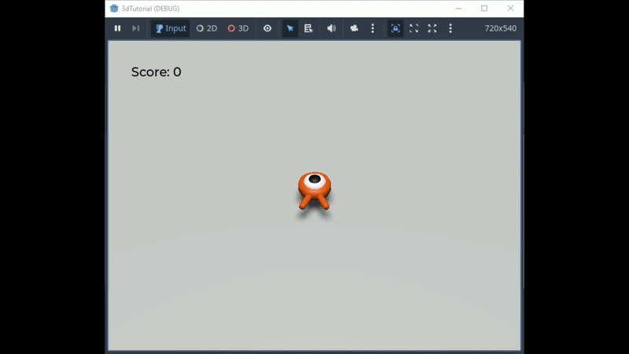

# 3DTutorial
Creating 3D game from godot beginners tutorial. It is similar to the first 2D game, with a twist: you can now jump and your goal is to squash the creeps.

Following the step-by-step guide from [Godot's Your first 3D game guide](https://docs.godotengine.org/en/4.4/getting_started/first_3d_game/index.html)
Extra: Gameplay area walls

Final gameplay demo:
